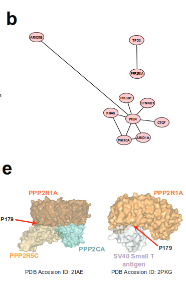
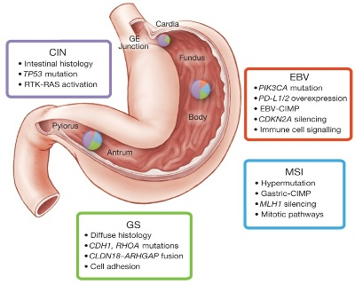

<!-- Limit image width and height -->
<style type="text/css">
img {
  max-height: 480px;
  max-width: 600px;
}
</style>

<style> .title-slide {
  background-image:url(http://33.media.tumblr.com/tumblr_m5tnjt5vDR1qbz9meo1_500.jpg);
  background-repeat: no-repeat;
  background-position: 90% 5%;
  background-size: 46%;
  background-color: #CBE7A5; /* ; ; */ }
  background-color: #FFFFFF; /*#CBE7A5 #EDE0CF; ; #CA9F9D*/
}
</style>

<!-- Center image on slide -->
<script src="http://ajax.aspnetcdn.com/ajax/jQuery/jquery-1.7.min.js"></script>
<script type='text/javascript'>
$(function() {
    $("p:has(img)").addClass('centered');
});
</script>

<!-- Italic -->
<style>
em {
  font-style: italic
}
</style>

<!-- Bold -->
<style>
strong {
  font-weight: bold;
}
</style>


---.segue .dark .nobackground
## Tuumor-onkoviiruste avastamine


--- &twocol
## Lindude leukeemia viraalne ülekanne


*** =left
- 1908 aastal näitasid Taani teadlased **Vilhelm Ellerman** (1871-1924) ja **Oluf Bang** (1881-1937) et **lindude leukeemia** (*avian viral leukemia*) kandub viraalsel teel üle.


*** =right


---&twocol
## Rousi kana sarkoomi mudel

- Aastatel 1909-11 katsetas **Francis Peyton Rous** (1879-1970) **kana sarkoomiga**.
- Rous leidis, et seda **tuumorit on võimalik kanadel üle kanda vähi rakkudest sõltumatult**.
-  Rous pälvis selle töö eest 1966. aastal Nobeli preemia.

***=left


***=right

<div style='text-align: center;'>
    
</div>

<footer class="source">Pilt: The Biology of Cancer. Garland Science.
</footer>

--- 
## Vähk võib olla nakkav
Mitmed uuringud näitasid loomadel vähi seost viirusnakkustega

- 1930-ndatel kirjeldati Richard E. Shope (1901-1966) and E. Weston Hursti (1900-1980) poolt **küülikute papilloomiviirus** 
- John Joseph Bittneri poolt (1904-1961) **hiirte piimanäärme viirus** (*mouse mammary tumor virus*, *MMTV*).
- 1950-ndatel avastati Ludwig Grossi (1904-1999) poolt **hiirte leukeemiaviirus** (retroviirus) ja **hiirte polüoomiviirus**.

--- &twocol
## Kas vähk on viirushaigus?

***=left


***=right
Hiirte peal leitud seos leukeemia ja viirusnakkuse vahel pani aluse hüpoteesile, et **vähk on viirushaigus**.

---.segue .dark .nobackground
## Viirused põhjustavad rakkude transformatsiooni

--- &twocol bg:lavender
## Rousi sarkoomiviirus muudab fibroblaste

1950-ndate lõpus ja 1960-ndatel uurisid Harry Rubin ja Howard Temin **Rousi sarkoomiviirust (RSV)** koekultuuris, kasutades kana fibroblaste (**CEF**)

*** =left


*** =right

- RSV nakatatud CEF-id moodustavad **kolooniad** (*foci/clusters*)
- kolooniaid moodustavad rakud on muutunud morfoloogiaga (**trasformeerunud**) ja sarnanevad sarkoomi rakkudega

---
## Transformeerunud rakkude iseloomulikud omadused

- kontakt-inhibitsiooni kadumine
- sõltumatus adhesioonist (*anchorage independence*) -- rakud kasvavad mitmes kihis
- poolduvad ~lõpmatult (immortaliseerumine)
- sõltumatus kasvufaktoritest, rakkude jagunemine ei arresteeru kasvufaktorite eemaldamisel
- kõrge gükoositransport
- tumorigeensus: moodustavad peremees-loomas tuumoreid 

<!-- --- -->
<!-- ## Lihtsa retroviiruse struktuur  -->
<!-- RSV virioon -->

<!--  -->

<!-- --- -->
<!-- ## Retroviirused transformeerivad kana ja hiire rakke -->
<!-- Mehhanism: **insertsiooniline mutagenees**  -->

<!--  -->

---
## Inimesel ei ole lihtsaid retroviiruseid

Inimesel otsiti vähkidest pikalt RSV sarnast lihtsat retroviirust, kuid vähiga seoses leiti ainult komplekssed retroviirused nagu HTLV-I ja HIV-1/-2.

---
## Vähki indutseeriva toimega on väga erinevad viirused

Tuumorviirus | Viirusperekond | Genoomi suurus (kb)
------------|-------------|--------------------------------
DNA viirused |
B-hepatiidi viirus (HBV) | hepadna | 3
SV40/polüoomi (*polyoma*) | papova | 5
inimese papilloomiviirus 16 (HPV) | papova | 8
inimese adenoviirus 5 | adenoviirus | 35
inimese herpesviirus 8 (HSV-8; KSHV) | herpesviirused | 165
Shope fibroomiviirus | poxviirused | 160
RNA viirused| 
Rousi sarkoomiviirus (RSV) | retroviirused | 9
inimese T-raku leukeemia viirus (HTLV-I) | retroviirus | 9

---
## Seitse viirust

- Praegusel ajal hinnatakse, et viirused vastutavad 10-15% vähijuhtumite eest maailmas. 
- Inimestel on leitud seitsmel (7) viirusel seos vähi tekkega.
- Inimese kasvajaviirused on kõik eri klassidest ja hõlmavad kogu viirus-spektrit.


--- 
## Inimese kasvaja-viirused

Viirus | Genoom | Kasvaja | Esmakirjeldus 
-------|--------|---------|---------------
Epstein-Barr viirus (EBV) | dsDNA herpesviirus | Burkitt'i lümfoom | 1964 
B-hepatiidi viirus (HBV) | ss/dsDNA hepadenoviirus | maksa kartsinoomid | 1965
inimese T-lümfotroopne viirus I (HTLV-I) | +ssRNA retroviirus | T-rakuline leukeemia | 1980
inimese papilloomiviirus (HPV-16/18) | dsDNA papilloomiviirus | emakakaela-, peenise-, anogenitaal- ja  pea-kaela kasvajad | 1983-84
C-hepatiidi viirus (HCV) | +ssRNA flaviviirus | maksa kartsinoomid ja lümfoomid | 1989
Kaposi sarkoomi herpesviirus (KSHV) | dsDNA herpesviirus | Kaposi sarkoom, kehaõõne-lümfoom | 1994
Merkeli rakkude polüoomiviirus | dsDNA polüoomiviirus | Merkeli rakkude kartsinoom | 2008

---
## Inimese vähid kus esineb kõrge viirusekspressioon


<footer class="source">Pilt: [The landscape of viral expression and host gene fusion and adaptation in human cancer](http://www.nature.com/ncomms/2013/131001/ncomms3513/full/ncomms3513.html)
</footer>

---
## Epstein-Barri viirus (EBV)

- EBV partiklid avastati elektronmikroskoopia teel nn. **Aafrika Burkitti lümfoomi** patsientidel.
- EBV on laialt levinud ekvatoriaal Aafrikas ja Paapua Uus-Guineas. 
    - Ainult 2.3% lümfoomidest on nn. Burkitti lümfoomid. 
    - ~100% patsientidest nakatunud.
    - võib kaasneda malaariast või kollapalavikust tingitud immuun-puudulikkusega.
- **Sporaadiline Burkitti lümfoom** esineb arenenud maades.
    - EBV negatiivne, kuid sisaldab iseloomulikke MYC-i translokatsioone. 


---
## Kasvajates reeglina viiruspartikleid ei leita

- Lisaks EBV-le on veel ainult üks inimese onkoviirus (T-lümfotroopne viirus I, HTLV-I) tuumorites kirjeldatud kasutades klassikalisi viroloogi töövahendeid: mikroskoopi ja viiruskultuuri.
- B hepatiidi seos maksakartsinoomiga tehti kindlaks 22707 Taiwani meest hõlmavas populatsiooniuuringus.
- HPV-16/18, C hepatiidi, Kaposi sarkoomi ja Merkeli rakkude polüoomiviirus identifitseeriti kasvajates molekulaarbioloogia meetodeid kasutades.

---
## Viiruse integratsioon on seotud märklaudgeenide ekspressiooni muutustega


<footer class="source">Pilt: [The landscape of viral expression and host gene fusion and adaptation in human cancer](http://www.nature.com/ncomms/2013/131001/ncomms3513/full/ncomms3513.html)
</footer>

---
## HPV ja emakakaelavähk

- 1980-ndatel oli teada, et inimese papilloomiviirused põhjustavad kondüloomide (*genital warts*) teket.
-  Selle põhal oletas Harald zur Hausen, et HPV võib olla seotud ka emakakaela vähi tekkega.
- Oma hüpoteesi kontrollimiseks **hübridiseeris ta papilloomiviiruse DNA emakakaelavähi DNA-le.**


---
## HPV16/18 seos emakakaela kasvajatega

```{r cervical, echo=FALSE, fig.height = 6, fig.align = 'center', fig.cap= "Emakakaela kasvajad (C53), esmaleiud vanusegrupiti, UK, 2009-2011"}
library(ggplot2)
library(ggthemes)
cc <- read.csv("data/cervicalcancer.csv")
ggplot(cc, aes(x = Age.Range, y = Female.Rates)) + 
  geom_bar(stat = 'identity') +
  ylab("Intsidents 100,000 kohta (naised)") + 
  xlab("Vanusegrupid") +
  ggtitle("Emakakaela kasvajad (C53), esmasleiud vanusegrupiti, UK, 2009-2011") + 
  theme(axis.text.x  = element_text(angle = 90, vjust = 0.5))
```

<footer class="source">Bosch FX, Lorincz A, Muñoz N, et al. The causal relation between human papillomavirus and cervical cancer. J Clin Path 2002; 55(4):244-265.
</footer>

---
## Kaposi sarkoom ja AIDS

Enne AIDSi epideemiat oli Kaposi sarkoom üliharuldane.


HIV ise ei ole tumorigeenne, kuid loob immuunpuudulikkuse näol keskkonna kasvaja-viiruste "kapist välja" tulemiseks.

---.segue .dark .nobackground
## Viiruste vähimehhanismid

---
## Viirused põhjustavad kasvajaid mitut moodi
Mehhanismid langevad kahte laia kategooriasse.

- **otsene mehhanism: insertsiooniline mutagenees**, onkviirused nakatavad normaalseid rakke ja integreeruvad genoomi põhjustades muutunud lokaalset geeniekspressiooni. Kui rakud koguvad veel lisamutatsioone või leiab aset immuunsüsteemi nõrgenemine, siis võivad sellised rakud viia vähi tekkeni. 

- **kaudne mehhanism**, viirusinfektsioon põhjustab põletikku. Krooniline põletik tõstab vähitekke riski selles koes.

---
## src paradigma

- Põhinedes RSV võimel mõni päev peale nakatamist rakke transformeerida, töötati 1958. Temini ja Rubini poolt välja nn **_focus assay_** 
- Fookuste hulk oli otseses seoses rakkudele lisatud RSV hulgaga, seega oli RSV täiesti piisav peremeesraku transformeerimiseks.

--- 
## Paljunemine ja raku transformeerimine on viirusel eraldi funktsioonid

- **raku fenotüüp on viiruse genoomi kontrolli all**, on olemas RSV mutandid, mis põhjustavad transformeerimisel rakkudel pikenenud fenotüübi;
- **viiruse paljunemine pole raku transformatsiooniks vajalik**, replikatsiooni-defektne mutant transformeeris rakke ilma viirust tootmata;
- **tekivad spontaansed mutandid mis replitseeruvad kuid enam ei transformeeri**, enamus RSV liine on mitte-defektsed (neil on genoomis olemas kõik viiruse replikatsiooniks vajalikud geenid, pluss onkogeen).

----
## RSV geenide aktiivsus on vajalik transformatsiooniks

- RSV-indutseeritud transformatsioon kandub järglasrakkudele edasi.
- Kas tegemist on nn. *hit and run* mehhanismiga või on viiruse aktiivsus transformatsiooniks permanentselt vajalik
    - *hit and run*: transformeerunud fenotüüp kandub edasi juba viirusest sõltumatult.
- Viirusgeenide vajalikkus selgus 1970ndatel kui kirjeldati temperatuuritundliku (*ts*) RSV mutandiga tehtud katseid:
    - transformatsioon oli temperatuuritundlik, kuid viiruse replikatsioon mitte.

---
## ALV/RSV virion


---
# Metsik tüüpi RSV vs. transformatsioonidefektne (td)

td RSV genoom on väiksem


---
## Lihtsa retroviiruse elutsükkel


---&twocol
## RSV src pärineb peremeesraku genoomist

***=left
Kasutades ära 1970 aastal RSV-st avastatud RNA sõltuvat DNA polümeraasi (pöördtranskriptaas) näidati, et selles viiruses olev transformeeriv src RNA järestus on pärit linnu genoomist.

*The Nobel Prize in Physiology or Medicine 1975 was awarded jointly to David Baltimore, Renato Dulbecco and Howard Martin Temin "for their discoveries concerning the interaction between tumour viruses and the genetic material of the cell".*

***=right


---

# Retroviiruste onkovalkude funktsionaalsed klassid
Klass | Näide | Viirus
-----------------|----------|--------------
kasvufaktor | Sis (PDGFB) | ahvi sarkoomiviirus
retseptor-türosiinkinaas | ErbB (EGFR) | linnu erütroblastoosi viirus
hormoonretseptor | ErbA (THRA) | linnu erütroblastoosi viirus
G valk | Ha-ras, GTPase | Harvey sarkoomiviirus
          | Ki-ras, GTPase|  Kirsten sarkoomiviirus
adaptorvalk | Crk, adaptorvalk | linnu sarkoomiviirus
mitte-retseptor TK| Src, tsütoplasma kinaas | Rousi sarkoomiviirus
                            | Abl, tsütoplasma kinaas | Abelsoni hiire leukemia virus
seriin/treoniin kinaas | Akt, tsütoplasma kinaas | Akt8 hiire thymoma virus
                        | Mos, tsütoplasma kinaas | Moloney hiire sarkoomiviirus
transkriptsiooni regulaator |  Jun, AP1 trans.fakt. | linnu sarkoomiviirus 17
                          | Fos, AP1 trans.fakt. | FBJ hiire sarkoomiviirus
                          | Myc, trans.fakt. | linnu müelotsütomatoosi viirus MC29
lipiidikinaas | Pi3k | linnu sarkoomiviirus 16

---
# Ka mitte transformeerivad viirused võivad aktiveerida proto-onkogeene genoomi insertsioonil
Geen | Viirus | Kasvaja | Liik | Onkovalk
-----|---------------------|------------|---------|-----------------------
myc | ALV | B-raku lümfoom | kana | transkriptsiooni faktor
myc | ALV, FeLV | T-raku lümfoom | kana, kass | transkriptsiooni faktor
nov | ALV | nefroblastoom | kana | kasvufaktor
erbB | ALV | erütroblastoos | kana | retseptor TK
int-1 (Wnt-1) | MMTV |  rinnanäärme kartsinoom |  hiir | kasvufaktor
int-2 (FGF) | MMTV | rinnanäärme kartsinoom | hiir | kasvufaktor
int-3 (notch)| MMTV | rinnanäärme kartsinoom|  hiir | retseptor
pim-1 | Mo-MLV | T-raku lümfoom | hiir | ser/thr kinaas
bmi-1 | Mo-MLV | T-raku lümfoom | hiir|  transkriptsiooni repressor
tpl-2 | Mo-MLV | T-raku lümfoom | hiir | mitte-retseptor TK
lck | Mo-MLV |  T-raku lümfoom | hiir | mitte-retseptor TK
p53 | Mo-MLV | T-raku lümfoom | hiir | transkriptsioonifaktor
IL2 | GaLV | T-raku lümfoom | gibbon ape | tsütokiin
K-ras |F-MLV | T-raku lümfoom | hiir | väike G valk
CycD1 | F-MLV | T-raku lümfoom | hiir | G1 tsükliin


---
## Viiruse onkogeenid: RNA versus DNA viirused

- Retroviiruste onkogeenid on rakulist päritolu ja peamiselt dereguleerivad signalisatsiooni ja transkriptsiooni kontrolli (SRC, MYC, RAS, ERBB).

- Onkogeensed DNA viirustel on aga genoomis isiklikud onkogeenid: HPV E6, SV40 LT (*large T*).

- **DNA viiruste onkogeenid toimivad rakuliste kontrollmehhanismide blokeerimise teel**, nt. HPV E6 ja SV40 LT inhibeerivad p53, HPV E7 inhibeerib RB-d.  

--- &twocol 
## Viiruse onkovalkude päritolu

Kas (i) viirus paneb rakulise jagunemise masinavärgi tööle selleks, et paljuneda või (ii) üritab immunsüsteemile märkamatuks jääda.

***=left


***=right
- Viiruse onkogeenid inhibeerivad raku tuumor-supressor funktsioone (**piiratud ressursid**), et tagada viiruse paljunemine ja vähi teke on tingitud juhuslikest mutatsioonidest.
- Viiruse strateegia on peremehe kaasasündinud (*innate*) immuunsuse vaiki hoidmine: tuumorsuppressorid on hõivatud ka kaasasündinud immuunsuses.

--- &twocol 
## Landscape of genomic alterations in cervical carcinomas

***=left

Relationships between HPV integration, copy-number amplifications and gene expression in cervical carcinoma

- HPV integration occurred closer to amplified regions than expected by chance. 
- Viral integration was localized to one locus in most tumours investigated. 
- Many of the genes involved in the integration events are members of cellular pathways known to have important roles in cancer.

***=right


---
## Altered immune response in cervical carcinomas

- Mutations in the HLA-B, HLA-A and in the β2-microglobulin (B2M) genes. 
- All mutations in these three genes were within the antigen-presenting domains of each respective protein.
- Pathway analyses also revealed that the most significantly mutated gene set in squamous cell carcinomas involves immune response genes in the interferon-γ signalling pathway, including mutations in IFNG and JAK2. 
- Together, these data highlight the significance of the synergy between HPV infection and an altered immune response in squamous cell carcinomas of the cervix.

--- &twocol
## SV40 kasutab sama mehhanismi mis spontaansetes kasvajates

***=left

- Endomeetriumi vähkides esinevad sageli koos PPP2R1A ja TP53 mutatsioonid.
- PPP2R1A on PP2A fosfataasi regulatoorne subühik, PP2A inhibeerib kasvufaktorite signalisatsiooni.
- TP53 on tuumorsuppressorgeen.
- SV40 _small T antigen_ seostub PPP2R1A valgule ja rikub PP2A regulatoorsete subühikute seostumise.
- SV40 _large T antigen_ põhjustab TP53 inactivatiooni.

***=right




<footer class="source">Pilt: The genomic landscape and evolution of endometrial carcinoma progression and abdominopelvic metastasis. [doi:10.1038/ng.3602](http://www.nature.com/ng/journal/vaop/ncurrent/full/ng.3602.html)
</footer>


--- &twocol
## Comprehensive molecular characterization of gastric adenocarcinoma

***=left

- EBV-d on leitud umbes 9% maovähkides.
- EBV alagruppi iseloomustab 9p lookuse amplifikatsioon 15% juhtudest.
- 9p lookuses asuvad JAK2, CD274 ja PDCD1LG2 geenid.
    - JAK2 retseptor-türosiinkinaas ja potensiaalne terapeutiline märklaud. 
    - CD274 ja PDCD1LG2 kodeerivad PD-L1 ja PD-L2 immunosuppresseerivaid valkeant nn. _checkpoint proteins_.
    - PD-L1 valku blokeerivad antikehad on hiljuti kliinilisse kasutusse jõudnud paljulubavad vähiterapeutikumid.

***=right




--- .segue .dark .nobackground

## Lingid loengutele

--- &twocol 

***=left 

- [Sissejuhatav loeng](http://tpall.github.io/sissejuhatus)
- [Vähitüübid](http://tpall.github.io/Vahityybid)
- [Onkoviirused](http://tpall.github.io/Onkoviirused)
- [Onkogeenid](http://tpall.github.io/Onkogeenid)
- [Retseptorid](http://tpall.github.io/Retseptorid)
- [Signaalirajad](http://tpall.github.io/Signaalirajad)
- [Tuumorsupressorgeenid](http://tpall.github.io/Tuumorsupressorid)
- [Rakutsüklikontroll](http://tpall.github.io/Rakutsyklikontroll)


***=right 

- [p53 ja apoptoos](http://tpall.github.io/p53-ja-apoptoos)
- [Immortalisatsioon](http://tpall.github.io/Immortalisatsioon)
- [Tumorigenees](http://tpall.github.io/Tumorigenees)
- [Genoomiterviklikkus](http://tpall.github.io/Genoomiterviklikkus)
- [Mikrokeskkond](http://tpall.github.io/Mikrokeskkond)
- [Metastaasid](http://tpall.github.io/Metastaas)
- [Immuunsus](http://tpall.github.io/Immuunsus)
- [Vahiravim](http://tpall.github.io/Vahiravim) 


