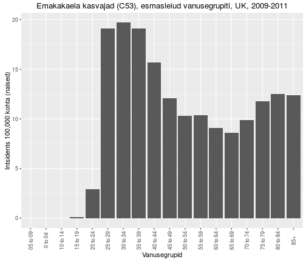

## Transformeerunud rakkude iseloomulikud omadused

- kontakt-inhibitsiooni kadumine
- sõltumatus adhesioonist (*anchorage independence*) -- rakud kasvavad mitmes kihis
- poolduvad ~lõpmatult (immortaliseerumine)
- sõltumatus kasvufaktoritest, rakkude jagunemine ei arresteeru kasvufaktorite eemaldamisel
- kõrge gükoositransport
- tumorigeensus: moodustavad peremees-loomas tuumoreid 

---
## Lihtsa retroviiruse elutsükkel
- Retroviirused transformeerivad kana ja hiire rakke.
- Mehhanism: **insertsiooniline mutagenees**.

    

<footer class="source">David Baltimore, Renato Dulbecco ja Howard Temin said pöördtranskriptaasi avastamise eest 1975. aastal Nobeli meditsiini preemia.
</footer>

---
## ALV/RSV virion

    

---&twocol
## src paradigma

***=left
- Põhinedes RSV võimel mõni päev peale nakatamist rakke transformeerida, töötasid 1958. Temin ja Rubin välja nn **_focus assay_** 
- Fookuste hulk oli otseses seoses rakkudele lisatud RSV hulgaga, seega oli RSV täiesti piisav peremeesraku transformeerimiseks.

***=right

<!-- 
 -->
<!--      -->
<!-- 
 -->

<footer class="source">Figure 3. Cell transformation by RSV. (A) The RSV focus assay of... - Scientific Figure on ResearchGate. Available from: https://www.researchgate.net/figure/51823723_fig3_Figure-3-Cell-transformation-by-RSV-A-The-RSV-focus-assay-of-transformed-cells-in-a
</footer>

--- 
## Paljunemine ja raku transformeerimine on viirusel eraldi funktsioonid

- **raku fenotüüp on viiruse genoomi kontrolli all**, on olemas RSV mutandid, mis põhjustavad transformeerimisel rakkudel pikenenud fenotüübi;
- **viiruse paljunemine pole raku transformatsiooniks vajalik**, replikatsiooni-defektne mutant transformeeris rakke ilma viirust tootmata;
- **tekivad spontaansed mutandid mis replitseeruvad kuid enam ei transformeeri**, enamus RSV liine on mitte-defektsed (neil on genoomis olemas kõik viiruse replikatsiooniks vajalikud geenid, pluss onkogeen).

<!-- ---- -->
<!-- ## RSV geenide aktiivsus on vajalik transformatsiooniks -->

<!-- - RSV-indutseeritud transformatsioon kandub järglasrakkudele edasi. -->
<!-- - Kas tegemist on nn. *hit and run* mehhanismiga või on viiruse aktiivsus transformatsiooniks permanentselt vajalik -->
<!--     - *hit and run*: transformeerunud fenotüüp kandub edasi juba viirusest sõltumatult. -->
<!-- - Viirusgeenide vajalikkus selgus 1970ndatel kui kirjeldati temperatuuritundliku (*ts*) RSV mutandiga tehtud katseid: -->
<!--     - transformatsioon oli temperatuuritundlik, kuid viiruse replikatsioon mitte. -->

---&twocol
## RSV src pärineb peremeesraku genoomist

***=left
Kasutades pöördtranskriptaasi näidati, et RSV-s olev transformeeriv src RNA järestus on pärit linnu genoomist.

***=right

---
## Metsik tüüpi RSV vs. transformatsioonidefektne (td)
- td RSV genoom on väiksem.

    

---
# Retroviiruste onkovalkude funktsionaalsed klassid
Klass | Näide | Viirus
-----------------|----------|--------------
kasvufaktor | Sis (PDGFB) | ahvi sarkoomiviirus
retseptor-türosiinkinaas | ErbB (EGFR) | linnu erütroblastoosi viirus
hormoonretseptor | ErbA (THRA) | linnu erütroblastoosi viirus
G valk | Ha-ras, GTPase | Harvey sarkoomiviirus
          | Ki-ras, GTPase|  Kirsten sarkoomiviirus
adaptorvalk | Crk, adaptorvalk | linnu sarkoomiviirus
mitte-retseptor TK| Src, tsütoplasma kinaas | Rousi sarkoomiviirus
                            | Abl, tsütoplasma kinaas | Abelsoni hiire leukemia virus
seriin/treoniin kinaas | Akt, tsütoplasma kinaas | Akt8 hiire thymoma virus
                        | Mos, tsütoplasma kinaas | Moloney hiire sarkoomiviirus
transkriptsiooni regulaator |  Jun, AP1 trans.fakt. | linnu sarkoomiviirus 17
                          | Fos, AP1 trans.fakt. | FBJ hiire sarkoomiviirus
                          | Myc, trans.fakt. | linnu müelotsütomatoosi viirus MC29
lipiidikinaas | Pi3k | linnu sarkoomiviirus 16

---
# Ka mitte transformeerivad viirused võivad aktiveerida proto-onkogeene genoomi insertsioonil
Geen | Viirus | Kasvaja | Liik | Onkovalk
-----|---------------------|------------|---------|-----------------------
myc | ALV | B-raku lümfoom | kana | transkriptsiooni faktor
myc | ALV, FeLV | T-raku lümfoom | kana, kass | transkriptsiooni faktor
nov | ALV | nefroblastoom | kana | kasvufaktor
erbB | ALV | erütroblastoos | kana | retseptor TK
int-1 (Wnt-1) | MMTV |  rinnanäärme kartsinoom |  hiir | kasvufaktor
int-2 (FGF) | MMTV | rinnanäärme kartsinoom | hiir | kasvufaktor
int-3 (notch)| MMTV | rinnanäärme kartsinoom|  hiir | retseptor
pim-1 | Mo-MLV | T-raku lümfoom | hiir | ser/thr kinaas
bmi-1 | Mo-MLV | T-raku lümfoom | hiir|  transkriptsiooni repressor
tpl-2 | Mo-MLV | T-raku lümfoom | hiir | mitte-retseptor TK
lck | Mo-MLV |  T-raku lümfoom | hiir | mitte-retseptor TK
p53 | Mo-MLV | T-raku lümfoom | hiir | transkriptsioonifaktor
IL2 | GaLV | T-raku lümfoom | gibbon ape | tsütokiin
K-ras |F-MLV | T-raku lümfoom | hiir | väike G valk
CycD1 | F-MLV | T-raku lümfoom | hiir | G1 tsükliin

---
## Inimesel ei ole lihtsaid retroviiruseid

- Inimesel otsiti vähkidest pikalt RSV sarnast lihtsat retroviirust, 
- Kuid vähiga seoses leiti ainult **komplekssed retroviirused** nagu HTLV-I (_Human T-lymphotropic virus_) ja HIV-1/-2.

---
## Vähki indutseeriva toimega on väga erinevad viirused

Tuumorviirus | Viirusperekond | Genoomi suurus (kb)
------------|-------------|--------------------------------
DNA viirused |
B-hepatiidi viirus (HBV) | hepadna | 3
SV40/polüoomi (*polyoma*) | papova | 5
inimese papilloomiviirus 16 (HPV) | papova | 8
inimese adenoviirus 5 | adenoviirus | 35
inimese herpesviirus 8 (HSV-8; KSHV) | herpesviirused | 165
Shope fibroomiviirus | poxviirused | 160
RNA viirused| 
Rousi sarkoomiviirus (RSV) | retroviirused | 9
inimese T-raku leukeemia viirus (HTLV-I) | retroviirus | 9

---
## Seitse viirust

- Praegusel ajal hinnatakse, et viirused vastutavad 10-15% vähijuhtumite eest maailmas. 
- Inimestel on leitud seitsmel (7) viirusel seos vähi tekkega.
- Inimese kasvajaviirused on kõik eri klassidest ja hõlmavad kogu viirus-spektrit.

    

--- 
## Inimese kasvaja-viirused

Viirus | Genoom | Kasvaja | Esmakirjeldus 
-------|--------|---------|---------------
Epstein-Barr viirus (EBV) | dsDNA herpesviirus | Burkitt'i lümfoom | 1964 
B-hepatiidi viirus (HBV) | ss/dsDNA hepadenoviirus | maksa kartsinoomid | 1965
inimese T-lümfotroopne viirus I (HTLV-I) | +ssRNA retroviirus | T-rakuline leukeemia | 1980
inimese papilloomiviirus (HPV-16/18) | dsDNA papilloomiviirus | emakakaela-, peenise-, anogenitaal- ja  pea-kaela kasvajad | 1983-84
C-hepatiidi viirus (HCV) | +ssRNA flaviviirus | maksa kartsinoomid ja lümfoomid | 1989
Kaposi sarkoomi herpesviirus (KSHV) | dsDNA herpesviirus | Kaposi sarkoom, kehaõõne-lümfoom | 1994
Merkeli rakkude polüoomiviirus | dsDNA polüoomiviirus | Merkeli rakkude kartsinoom | 2008

---
## Inimese vähid kus esineb kõrge viirusekspressioon

    

<footer class="source">Pilt: [The landscape of viral expression and host gene fusion and adaptation in human cancer](http://www.nature.com/ncomms/2013/131001/ncomms3513/full/ncomms3513.html)
</footer>

---&twocol
## Epstein-Barri viirus (EBV, HHV-4)

***=left
- EBV partiklid kirjeldati **Aafrika Burkitti lümfoomi** patsientidel.
- EBV on laialt levinud ekvatoriaal Aafrikas ja Paapua Uus-Guineas. 
    - Ainult 2.3% lümfoomidest on BL. 
    - ~100% patsientidest nakatunud.
    - võib kaasneda malaariast või kollapalavikust tingitud immuun-puudulikkusega.
- **Sporaadiline BL** esineb arenenud maades.
    - EBV negatiivne, kuid sisaldab MYC-i translokatsioone. 

***=right

    

---
## Kasvajates reeglina viiruspartikleid ei leita

- Lisaks EBV-le on veel ainult T-lümfotroopne viirus I (HTLV-I) tuumorites kirjeldatud kasutades **mikroskoopi ja viiruskultuuri**.
- B hepatiidi seos maksakartsinoomiga tehti kindlaks 22707 Taiwani meest hõlmavas **populatsiooniuuringus**.
- HPV-16/18, C hepatiidi, Kaposi sarkoomi ja Merkeli rakkude polüoomiviirus identifitseeriti kasvajates **molekulaarbioloogia meetodeid** kasutades.

---
## HPV ja emakakaelavähk

- 1980-ndatel oli teada, et inimese papilloomiviirused põhjustavad kondüloomide (*genital warts*) teket.
-  Selle põhal oletas Harald zur Hausen, et HPV võib olla seotud ka emakakaela vähi tekkega.
- Oma hüpoteesi kontrollimiseks **hübridiseeris ta papilloomiviiruse DNA emakakaelavähi DNA-le.**

    

---
## HPV16/18 seos emakakaela kasvajatega
Population studies provide support for the concept that HPV infections precede the development of cervical cancer by some decades.

<footer class="source">Bosch FX, Lorincz A, Muñoz N, et al. The causal relation between human papillomavirus and cervical cancer. J Clin Path 2002; 55(4):244-265.
</footer>

---.segue .dark .nobackground
## Viiruste vähimehhanismid

---
## Viirused põhjustavad kasvajaid mitut moodi
Mehhanismid langevad kahte laia kategooriasse.

- **otsene mehhanism: insertsiooniline mutagenees**, onkviirused nakatavad normaalseid rakke ja integreeruvad genoomi põhjustades muutunud lokaalset geeniekspressiooni. Kui rakud koguvad veel lisamutatsioone või leiab aset immuunsüsteemi nõrgenemine, siis võivad sellised rakud viia vähi tekkeni. 

- **kaudne mehhanism**, viirusinfektsioon põhjustab põletikku. Krooniline põletik tõstab vähitekke riski selles koes.

---
## Viiruse integratsioon on seotud märklaudgeenide ekspressiooni muutustega

    

<footer class="source">Pilt: [The landscape of viral expression and host gene fusion and adaptation in human cancer](http://www.nature.com/ncomms/2013/131001/ncomms3513/full/ncomms3513.html)
</footer>

---
## Viiruse integratsioon on seotud koopiaarvu muutustega
HPV genoomi integratsioonikohad kolokaliseeruvad DNA koopia-arvu muutustega pea-kaela kasvajates (HNSC).

    

<footer class="source">Pilt: [The landscape of viral expression and host gene fusion and adaptation in human cancer](http://www.nature.com/ncomms/2013/131001/ncomms3513/full/ncomms3513.html)
</footer>

---&twocol
## Kaposi sarkoom ja AIDS
Enne AIDSi epideemiat oli Kaposi sarkoom üliharuldane.

***=left

    

***=right
HIV ise ei ole tumorigeenne, kuid loob immuunpuudulikkuse näol keskkonna kasvaja-viiruste "kapist välja" tulemiseks.

<!-- --- -->
<!-- ## Viiruse onkogeenid: RNA versus DNA viirused -->

<!-- - Retroviiruste onkogeenid on rakulist päritolu ja peamiselt dereguleerivad signalisatsiooni ja transkriptsiooni kontrolli (SRC, MYC, RAS, ERBB). -->

<!-- - Onkogeensed DNA viirustel on aga genoomis isiklikud onkogeenid: HPV E6, SV40 LT (*large T*). -->

<!-- - **DNA viiruste onkogeenid toimivad rakuliste kontrollmehhanismide blokeerimise teel**, nt. HPV E6 ja SV40 LT inhibeerivad p53, HPV E7 inhibeerib RB-d.   -->

<!-- --- &twocol  -->
<!-- ## Viiruse onkovalkude päritolu -->

<!-- Kas (i) viirus paneb rakulise jagunemise masinavärgi tööle selleks, et paljuneda või (ii) üritab immunsüsteemile märkamatuks jääda. -->

<!-- ***=left -->
<!--  -->

<!-- ***=right -->
<!-- - Viiruse onkogeenid inhibeerivad raku tuumor-supressor funktsioone (**piiratud ressursid**), et tagada viiruse paljunemine ja vähi teke on tingitud juhuslikest mutatsioonidest. -->
<!-- - Viiruse strateegia on peremehe kaasasündinud (*innate*) immuunsuse vaiki hoidmine: tuumorsuppressorid on hõivatud ka kaasasündinud immuunsuses. -->

<!-- --- &twocol  -->
<!-- ## Landscape of genomic alterations in cervical carcinomas -->

<!-- ***=left -->

<!-- Relationships between HPV integration, copy-number amplifications and gene expression in cervical carcinoma -->

<!-- - HPV integration occurred closer to amplified regions than expected by chance.  -->
<!-- - Viral integration was localized to one locus in most tumours investigated.  -->
<!-- - Many of the genes involved in the integration events are members of cellular pathways known to have important roles in cancer. -->

<!-- ***=right -->

<!--  -->

<!-- --- -->
<!-- ## Altered immune response in cervical carcinomas -->

<!-- - Mutations in the HLA-B, HLA-A and in the β2-microglobulin (B2M) genes.  -->
<!-- - All mutations in these three genes were within the antigen-presenting domains of each respective protein. -->
<!-- - Pathway analyses also revealed that the most significantly mutated gene set in squamous cell carcinomas involves immune response genes in the interferon-γ signalling pathway, including mutations in IFNG and JAK2.  -->
<!-- - Together, these data highlight the significance of the synergy between HPV infection and an altered immune response in squamous cell carcinomas of the cervix. -->

<!-- --- &twocol -->
<!-- ## SV40 kasutab sama mehhanismi mis spontaansetes kasvajates -->

<!-- ***=left -->

<!-- - Endomeetriumi vähkides esinevad sageli koos PPP2R1A ja TP53 mutatsioonid. -->
<!-- - PPP2R1A on PP2A fosfataasi regulatoorne subühik, PP2A inhibeerib kasvufaktorite signalisatsiooni. -->
<!-- - TP53 on tuumorsuppressorgeen. -->
<!-- - SV40 _small T antigen_ seostub PPP2R1A valgule ja rikub PP2A regulatoorsete subühikute seostumise. -->
<!-- - SV40 _large T antigen_ põhjustab TP53 inactivatiooni. -->

<!-- ***=right -->

<!--  -->

<!-- <footer class="source">Pilt: The genomic landscape and evolution of endometrial carcinoma progression and abdominopelvic metastasis. [doi:10.1038/ng.3602](http://www.nature.com/ng/journal/vaop/ncurrent/full/ng.3602.html) -->
<!-- </footer> -->

<!-- --- &twocol -->
<!-- ## Comprehensive molecular characterization of gastric adenocarcinoma -->

<!-- ***=left -->

<!-- - EBV-d on leitud umbes 9% maovähkides. -->
<!-- - EBV alagruppi iseloomustab 9p lookuse amplifikatsioon 15% juhtudest. -->
<!-- - 9p lookuses asuvad JAK2, CD274 ja PDCD1LG2 geenid. -->
<!--     - JAK2 retseptor-türosiinkinaas ja potensiaalne terapeutiline märklaud.  -->
<!--     - CD274 ja PDCD1LG2 kodeerivad PD-L1 ja PD-L2 immunosuppresseerivaid valke nn. _checkpoint proteins_. -->
<!--     - PD-L1 valku blokeerivad antikehad on hiljuti kliinilisse kasutusse jõudnud paljulubavad vähiterapeutikumid. -->

<!-- ***=right -->

<!--  -->

--- .segue .dark .nobackground
## Kuidas seletada vähi teket inimesel

--- 
## Endogeensed proviirused?

- Lähtudes retroviiruste elutsüklist, integreeruvad genoomi **endogeensete retroviirustena**,
- satuvad idutee rakkudesse ja muutuvad pärilikuks,
- enamasti vaikeolekus, ei transkribeeri oma geene,
- juhuslik ning harv aktiveerumine.

--- 
## Endogeensed proviirused hiirtel

- BrdU aktiveerib Akr liini hiirtel endogeensed retroviirused (*MLV, murine leukemia virus*)
    - DNA metülatsioon eemaldatakse lookusest ja vaigistamine kaob
- Akr liini hiirtel on kaks lookust kuhu on integreerunud replikatsiooni-kompetentne MLV
- MLV produktsioon viib leukeemia tekkele.

    

<footer class="source">Pilt: ~5% hiire genoomist sisaldab endogeenseid retroviirus järjestusi. [Endogenous Retroviruses and the Development of Cancer](http://www.jimmunol.org/content/192/4/1343.full)
</footer>

--- 
## Inimese ERV-d... FUBAR

- 8% inimese genoomist pärineb retroviirustest, kuid
- inimese kasvajatest pole leitud retroviiruseid ega jälgigi nendest (pöörd-transkriptaas),
- inimese LTR-i sisaldavad järjestused on pärit vähemalt >5M aasta tagusest ajast, 
    - tugevasti muteerunud, 
    - mittefunktsionaalsed,
    - läbinud geenitriivi ja fikseerunud (populatsioonis on kõigil identne lookus).
- HERV-K alamperekonnas on lookuseid millel on kõik ORF-id intaktsed, kuid viirust neilt ei toodeta ja neid pole ka vähkides leitud.

---
## Kui mitte viirused, siis mis tekitab vähki? Kartsinogeenid!

- Kartsinogeenid toimivad mutageenidena ja nende toime-mehhanismiks on raku kasvukontrolli geenide muteerimine.
- Sellisteks kasvukontrolli geenideks võivad olla normaalsed raku geenid, sarnaselt retroviirustest leitud proto-onkogeenidega.

    

<footer class="source">Pilt:artrepublic.com
</footer>

--- &twocol
## Keemilised kartsinogeenid kutsuvad esile kasvajaid

***=left

    

Katsusaburō Yamagiwa

***=right
- 1915. aastal demonstreeris pigi kartsinogeense toime
- pintseldas küüliku kõrvu igapäevaselt pigiga,
- mitu kuud hiljem moodustus lamerakuline kartsinoom.

---&twocol
## Kartsinogeenid toimivad mutageenidena

***=left
- Tugevalt mutageensed ühendid on ka tugevalt kartsinogeensed (nt. aflatoksiin B1, benso(a)püreen). 
- Füüsilise või keemilise kartsinogeeni poolt transformeerunud rakud kannavad muteerunud geene e. onkogeene, mis rikuvad normaalse kasvukontrolli.

***=right

    

--- &twocol
## Onkogeenid tekivad ka viirustest sõltumatult
DNA transfektsioon võimaldas isoleerida mitte-viraalsed onkogeenid

***=left

- Hiire C3HT1/2 rakke töödeldi mutageeni 3-metüülkolantreeni (3-ME, MCA) abil,
- transformeerunud rakkudest isoleeriti genoomne DNA,
- eraldatud DNA transformeeriti mitte-tumorigeensetesse NIH3T3 rakkudesse,
- isoleeriti kolooniad mis olid transformeerunud ja tumorigeensed.
- 1 onkogeen = 1 transformeerunud rakk/koloonia

***=right

    

<footer class="source">Pilt: Sue Weil, Memorial Sloan-Kettering Cancer Center
</footer>

--- &twocol
## Retroviiruste poolt aktiveeritud onkogeenid on samad mis mitte-viraalsete kartsinogeenide aktiveeritud

***=left
- Harvey roti sarkoomiviiruse H-ras proov hübridiseerub inimese kusepõie kartsinoomi DNA-ga transfekteeritud NIH3T3 rakkude genoomsele DNA-le ([Parada et al., 1982](http://www.ncbi.nlm.nih.gov/pubmed/6283357):  paremal).

***=right

    

----
# Inimese vähkide retroviraalsed onkogeenid

Viirus | Liik | Onkogeen | Onkovalk | Inimese kasvaja
-------|------|----------|----------|----------------------------
Rousi sarkoom | kana | src | mitte-retseptor TK | käärsoole vähk
Abelsoni leukeemia | hiir | abl | mitte-retseptor TK | CML
Lindude erütroblastoos | hiir | erbB | retseptor TK | mao-, kopsu- ja rinnavähk
McDonough' kassi sarkoom | kass | fms | retseptor TK | AML
Hardy-Zuckerman kassi viirus | kass | kit | retseptor TK | GI strooma vähk
Hiire sarkoom 3611 | hiir | raf | Ser/Thr kinaas | kusepõie kartsinoom
*Simian sarcoma* | ahv | sis | kasvufaktor (PDGF) | erinevad vähid
Harvey' sarkoom | hiir/rott | H-ras | väike G-valk | kusepõie kartsinoom
Kirsten'i sarkoom | hiir/rott | K-ras | väike G-valk | erinevad vähid
Lindude erütroblastoos E26 | kana | ets | transkriptsioonifaktor | leukeemia
Lindude müelotsütoom | kana | myc | transkriptsioonifaktor | erinevad vähid
Retikuloendotelioos | kalkun | rel | transkriptsioonifaktor | lümfoom

---
## Proto-onkogeenide aktivatsioon

Proto-onkogeenide aktivatsioon toimub läbi kahte tüüpi geneetiliste muutuste:

- valguekspressiooni mõjutavad muutused
- valgu struktuuri mõjutavad muutused

    

---
## Valguekspressiooni mõjutavad muutused

- Normaalsetes rakkudes on proto-onkogeeni ekspressioon kas alla või ülesse reguleeritud omaenda promootori poolt vastusena füsioloogilistele signaalidele
- Retroviirusega seotud onkogeenide puhul läheb geen raku kontrolli alt viiruse kontrolli alla
    - c-myc ekspressioon on füsioloogilistes tingimustes kasvufaktorite kontrolli all
    - AMV (Avian Myeoloblastosis Virus) genoomis hakatakse aga v-myc järjestust konstitutiivselt kõrgelt ekspresseerima, sõltumata füsioloogilistest signaalidest mis seda geeni varem reguleerisid.
- Inimese kasvajates on peamiseks mehhanismiks lookuse amplifikatsioon (tsükliin D1, erbB2) 

---&twocol
## erbB2/neu onkogeeni amplifikatsioon rinnakasvajates

- 1987. a. kirjeldati seos erbB2/neu geeni amplifikatsiooni ja rinnavähi elulemuse ning relapsi vahel.

***=left

***=right

    

<footer class="source">Slamon DJ, Clark GM, Wong SG, Levin WJ, Ullrich A, McGuire WLHuman breast cancer: correlation of relapse and survival with amplification of the HER-2/neu oncogene. Science 235: 177-182.
</footer>

---&twocol
## Valgu struktuuri mõjutavad muutused
Punktmutatsioonid

***=left

- H-ras isoleeriti inimese kusepõie kartsinoomist,
- H-ras ei olnud amplifitseerunud!,
- sekveneerimine näitas somaatilist G->T punktmutatsiooni, mis oli täiesti piisav et H-ras onkogeeniks muuta
- Vähides esinev mutatsioon koodonites 12 või 61 (G12V) muudab Ras-i konstitutiivselt aktiivseks rikkudes Ras-i GTPasse aktiivsuse

***=right

    

<footer class="source">CLIFFORD J. TABIN, SCOTT M. BRADLEY, CORNELIA I. BARGMANN, ROBERT A. WEINBERG, ALEX G. PAPAGEORGE, EDWARD M. SCOLNICK, RAVI DHAR, DOUGLAS R. LOWY & ESTHER H. CHANG. Mechanism of activation of a human oncogene. Nature 300, 143 - 149 (11 November 1982); doi:10.1038/300143a0
</footer>

---
# Ras perekonna geenid on vähkides ühed sagedamini muteerunud

Vähipaige/tüüp | % muteerunud RAS geeniga (homoloog)
---------|-------------------------
kõhunääre | 90 (K)
kilpnääre (papillaarne) | 60 (H,K,N)
kilpnääre (follikulaarne) | 55 (H,K,N)
käärsool | 45 (K)
seminoom | 45 (K,N)
müelodüsplaasia | 40 (N,K)
kops (mitte-väikserakuline) | 35 (K)
AML | 30 (N)
maks | 30 (N)
melanoom | 15 (K)
kusepõis | 10 (K)
neer | 10 (H)

---&twocol
## Valgu struktuuri mõjutavad muutused
Translokatsioonid

***=left

- BCR-ABL1 fuusion
- ABL1 on türosiin kinaas, mille fuusion BCR valguga muudab selle konstitutiivselt aktiivseks
- 95% CML juhtudest sisaldab t(9;22) nn. _Philadelphia kromosoomi_

***=right

--- &twocol
## N-MYC amplifikatsioon pärilikes neuroblastoomides
MYC perekonna transkriptsiooni faktor mis reguleerib raku rakutsüklisse sisenemist ja rakkude ellujäämist.

***=left

Kahte tüüpi amplifikatsioone

- HSR, homogeenselt värvuvad piirkonnad
- DM, *double minutes*: kromosoomi välised partiklid
- amplifikatsioonid on bimodaalsed 10-30 koopiat ja 100-150 koopiat
- lisaks neuroblastoomidele ka teistes neuroektodermaal kasvajates, astrotsütoomid, glioomid, ka väikse-rakulises kopsukasvajas.

***=right
*HSR* ja *double minutes* (nooled)

--- 
## c-MYC aktivatsiooni mehhanismid 

Kolm mehhanismi, kõik regulatoorsed:
- proviiruse integratsioon (linnud)
- geeni amplifikatsioon (inimene)(metastaseeruvad rinna- ja munasarjavähid)
- kromosomaalsed translokatsioonid (lümfoomides)

--- &twocol
## Sagedamini amplifitseerunud genoomipiirkonnad

***=left

***=right

Top 10 korduvad koopiaarvu muutused (SCNA):

Geen | Funktsioon
-----|-----------
CCND1 | G1 tsükliin
EGFR | TK retseptor
MYC | transkripts. faktor
ERBB2 | TK retseptor
CCNE1 | G1 tsükliin
MCL1 | anti-apoptootiline valk
MDM2 | p53 E3 ubikvitiini ligaas

<footer class="source">Pan-cancer patterns of somatic copy number alteration. Travis I Zack,  Steven E Schumacher,  Scott L Carter,	Andrew D Cherniack,	Gordon Saksena,	Barbara Tabak,	Michael S Lawrence,	Cheng-Zhong Zhang,	Jeremiah Wala,	Craig H Mermel,	Carrie Sougnez,	Stacey B Gabriel,	Bryan Hernandez,	Hui Shen,	Peter W Laird,	Gad Getz,	Matthew Meyerson	& Rameen Beroukhim Nature Genetics 45, 1134–1140 (2013) doi:10.1038/ng.2760
</footer>

--- &twocol
## MYC translokatsioon Burkitti lümfoomides

MYC aktivatsioon translokatsioonilise mehhanismi teel

***=left

- c-myc geene translokeeritakse immunoglobuliini lookusesse kõigis BL.
- Immunoglobulin raske ahel IgH 80%,
$\kappa$ või $\lambda$ kerge ahel, kumbagi 10%.

Translokatsioon | Fuusion | Sagedus
----------------|--------|--------
t(8;14)(q24;q32)| IGH/MYC | 80%
t(2;8)(p12;q24) | IGK/MYC | 10%
t(8;22)(q24;q11) | IGL/MYC | 10 %

***=right

---
## EGFR ligand-sõltumatu signalisatsioon
Mao- ja rinna kartsinoomides, glioblastoomides

    

<!-- --- -->
<!-- ## BCR-ABL translokatsioon -->
<!-- Leukeemiates ja lümfoomides -->

<!-- 
 -->
<!--      -->
<!-- 
 -->

---
## Kokkuvõte

- Onkogeen on geen mis võib potentsiaalselt vähki tekitada ja vähkides on nad muteerunud või ekspresseeritud ebanormaalselt kõrgel tasemel.
- Proto-onkogeen on normaalne geen mis võib muutuda onkogeeniks.

---&twocol 
## Lingid loengutele

***=left 

- [Sissejuhatav loeng](http://tpall.github.io/onkobioloogia)
- [Viirused ja onkogeenid](http://tpall.github.io/viirused-ja-onkogeenid)
- [Retseptorid](http://tpall.github.io/Retseptorid)
- [Signaalirajad](http://tpall.github.io/Signaalirajad)
- [Tuumorsupressorgeenid](http://tpall.github.io/Tuumorsupressorid)
- [Rakutsüklikontroll](http://tpall.github.io/Rakutsyklikontroll)

***=right 

- [p53 ja apoptoos](http://tpall.github.io/p53-ja-apoptoos)
- [Immortalisatsioon](http://tpall.github.io/Immortalisatsioon)
- [Tumorigenees](http://tpall.github.io/Tumorigenees)
- [Genoomiterviklikkus](http://tpall.github.io/Genoomiterviklikkus)
- [Mikrokeskkond](http://tpall.github.io/Mikrokeskkond)
- [Metastaasid](http://tpall.github.io/Metastaas)
- [Immuunsus](http://tpall.github.io/Immuunsus)
- [Vähiravim](http://tpall.github.io/Vahiravim) 

